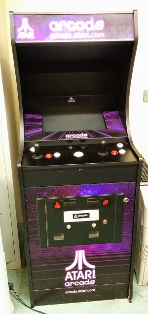
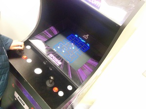

# Game Programming 2023 - Assignment 2

## Instructions

- This is team project for up to 3 people
- Fork this git repo and use the forked repo to keep track of your work
- Each team member must make commits on the repo
- Edit the readme.md file in the forked repo with your documentation (see below)

## Project Brief

The goal of this project is to create a simple, 1 or 2 player retro-style, vector-graphics game in Processing to run on this arcade cabinet. There is starter code in this repo that you should base your project off. The key bindings are stored in a file called arcade.xml. When you run the starter project you will see two squares that can be moved using the keys in the key bindings file.

Important! Your game should be inspired by a scene in a Stanley Kubrick movie
You can make any game you like. Wacky, far-out, silly ideas that don't work are welcome!

 

For inspiration: 

[Vector arcade games on Wikipedia](http://en.wikipedia.org/wiki/Category:Vector_arcade_games)

[Vectrex games](http://en.wikipedia.org/wiki/Category:Vectrex_games)

Also consider downloading [MAME](http://mamedev.org/) and playing some retro games.

I want to bring the cabinet to the State of Play festival and the Project fair with all of your games running on it. You will be able to select the game to play from a menu of all your games. That way 100's of people will see and play your games.  The rules:

- You must include a splash screen with instructions, game screen(s) and a game-over screen
- You should make all the art yourself. I suggest you procedurally draw everything to make a vector graphics style game. 
- Keep in mind the theme for this years Games Fleadh is "Endless Runner" so you might want to make one of these and enter it into Games Fleadh too!
- Each team member must contribute code to the project.

Marks:

Code: 30%
Gameplay:30%
Project management: 20%
Visuals: 20%

## Rubric

| Grade | Description |
| ------|-------------|
| First | A project that looks great. All the art and is 100% procedural or self drawn and looks beautiful. There a significant amount of clever animation or gameplay (if the project is a game). For example multiple "modes" or "screens". The assignment has lots of functionality. There is depth to the gameplay. For example, progression and powerups. The code is organised into classes that make use of inheritance and polymorphism. There is a lot of novelty and originality. All the code is written by the you. You will have used PVectors, transforms and classes to create autonomous elements in the assignment. You will loading content from text files. You will have used git extensively. Everything works. Example: A twin stick shooter|
| 2.1 | The project looks good. There is a some animation or gameplay. You put in a good effort. Some features may not be complete or entirely working. Probably no file IO, but there should be while loops, for loops if statements etc to control aspects of the assignment. You have used classes, but possibly not inheritance and polymorphism. Maybe used git to do one or two commits. Example: A simple space shooter. |
| 2.2 | The project looks so so, but is pretty basic. There should be some animation or gameplay but significant issues that you couldn't resolve. You may have used sprites instead of drawing everything. All the movement and animation code will be pretty basic for example colours changing each frame or movement controlled by variables that just update each frame. Little or no control code. There is not much code, maybe a page or two. Example: A basic Pong game |
| Pass | All code in one file. Around a hundred lines of code. Looks like it could have been completed in an hour or two. Mostly drawing code, little or no controling code. Little or no functionality. Lots of code acquired from other sources. Example: An incomplete Pong game|
| Fail | Something very basic that looks like it could have been completed in an hour. Just drawing code, no control code. The assignment has no interactivity. Significant unaddressed technical problems  |
